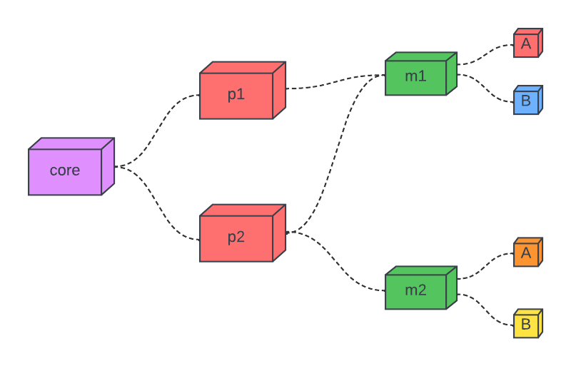
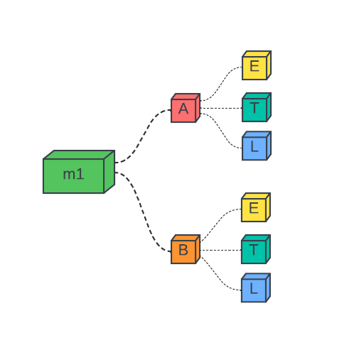

# Cluster.tools Overview

The **core** acts as a facade for zero to many **processors** responsible for providing compute. The facade provides an operator the ability to manage resource, configurations, mount states, and provisions towards the **processors**.

## The core and the processor

The **core** is responsible for managing a distributed deployment while a **processor** is an instance in the deployment that provides compute to run a function.

### Understanding the core

The **core** is responsible for holding the context of resources active in the deployment and facilitating communication between an operator and the resources. 

During startup the core begins by launching threads; a database to manage records, a cache to store temporary objects in memory, tables to manage

The core allows and operator and processor to communicate with itself through exposed endpoints:

1. The [client](./architecture/endpoints/client.md) endpoint
2. The [processor](./architecture/endpoints/processor.md) endpoint

### Understanding the processor

The **processor** is responsible for registering itself to the **core** on startup, allowing the **core** to manage its compute. The **processor** organizes the compute in **modules** and **clusters**. Modules contain a set of provisional functions **clusters**   

  <i>Figure 1. a core connect to two (2) processors p1 and p2</i>

## The module

A **module** encapsulates common functional elements together and provides the opportunity to version and accredit its developers. 

### It's all a set of clusters

The smallest referable functional unit in *cluster.tools* is a **cluster**. A cluster represents a set of functions that make-up an [extract transform load (etl)](https://en.wikipedia.org/wiki/Extract,_transform,_load) process whose functionality is invoked as one.

  <i>Figure 2. a module wrapping two (2) clusters m1.A and m1.B </i>

Figure 2 shows two clusters *m1.A* and *m1.B* that represent unique etl sets where *m1.A* performs a transformation on data-type *A* and *m1.B* performs a transformation on data-type *B*. Both *A* and *B* are separate data-types but share a common functional use so they can be grouped together in module *m1*.

The processor can choose what modules it wants to support at any point in its lifecycle, it is up to the processor to inform the core when it wants to support a module. Once the core is aware that a processor supports a module it can begin directing provisioning requests from the facade to the processor.

### Provisioning a cluster