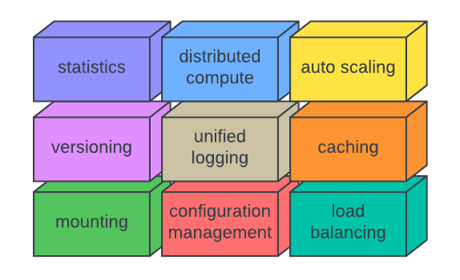

# Cluster.tools

Cluster.tools is an open-source orchestration and developer framework for simplifying the deployment of distributed etl functions. The simplicity comes from the rich set of deployment monitoring, high-availability, and auto-scaling tools provided out of the box.

    [!] updating the content on this site is currently in progress

### Built from an Operator & Developer Perspective
Cluster.tools was developed from an operators perspective. When developing functions distributed in a private, public, or hybrid network what is the easiest way to version manage, load balance, monitor, and control access to these functions.

A standard interface definition using HTTP and JSON also allows you to create a wrapper on top of any software so that it can interface with cluster.tools. 

### What are some Use Cases?

1. I want to load balance requests across several distributed deployments.
2. I want to dynamically control access to functions in case of unexpected behavior.
3. I want to update one unit of code without affecting service to unrelated units.
4. I want to track the amount of data processed and how long it took.
5. I want a central location to receive logs from distributed processes.
6. I want a central configuration management solution that can be distributed across functions.

### Why did you start this?

Cluster.tools was started in parallel with a separate project to handle deploying etl functions in golang. Over time it evolved into its own project that is continued to this day.